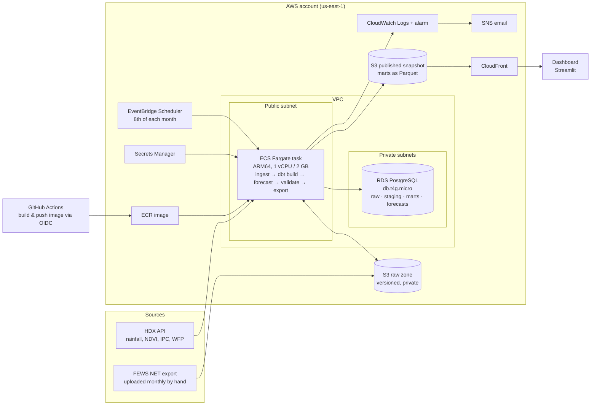

# AWS target architecture (v2)

This is the production design for running the pipeline on AWS. It is written, not deployed (DL-013): v1 runs on free tiers (Neon, GitHub Actions, Streamlit Community Cloud) at no cost, and that is the right choice for a monthly job over a few tens of thousands of rows. The AWS version exists to show how the same pipeline would run inside an organisation's own cloud account, with private networking, managed secrets, monitoring and a cost ceiling.

## What changes and what doesn't

The code stays the same. Only where things run and where files live changes:

| Today (v1) | On AWS (v2) |
|---|---|
| GitHub Actions monthly cron | **EventBridge Scheduler** starts an **ECS Fargate** task on the 8th |
| Files downloaded to `data/raw/` on the runner | **S3 raw zone** (versioned bucket) |
| FEWS NET export saved in `data/raw_manual/` | Export uploaded to `s3://…/raw/manual/fpma/` |
| Neon PostgreSQL | **RDS for PostgreSQL**, private subnet |
| `DATABASE_URL` as a GitHub secret | **Secrets Manager**, read by the task role |
| Run results attached to the Actions run | Written to `s3://…/reports/`, logs in **CloudWatch** |
| Dashboard reads Neon as `dashboard_reader` | Dashboard reads a **mart snapshot from S3**; the database is never exposed |

## Diagram

## Components and why

**Scheduling: EventBridge Scheduler → ECS Fargate task.** The pipeline is one linear job a month (DL-011). A Fargate task runs the same container the GitHub workflow runs today, with no server to patch and no time limit. Lambda was considered: it fits in time (a run takes a few minutes) but dbt, LightGBM and statsmodels make a large container image, and the 15-minute ceiling would become a constraint if the backtest ever moved into the scheduled run.

**Raw zone: S3 with versioning.** Every downloaded file is stored as an object version, so the "nothing is overwritten" rule (DL-005, DL-019) holds for files as well as rows. Block Public Access is on. The FEWS NET export, which has no API (DL-016), is uploaded to a `raw/manual/fpma/` prefix; the task loads the newest object.

**Database: RDS for PostgreSQL, db.t4g.micro, Single-AZ, private subnets.** The warehouse is small and written once a month, so the smallest Graviton instance is enough. Storage encrypted, automated backups kept 7 days. Multi-AZ is not justified: if the database is down, the dashboard keeps serving the last snapshot (below), and the monthly job can be re-run. Aurora Serverless was considered and rejected as more than this workload needs.

**Dashboard: reads a snapshot, not the database.** At the end of each run the task exports the tables the dashboard uses (`fct_risk_index_monthly`, `fct_ipc_county_analysis`, `fct_maize_price_monthly`, `fct_price_forecast`) as Parquet to a separate S3 bucket, served through CloudFront. This keeps the database in private subnets with no public endpoint, removes the need for a read-only database role, and means the dashboard keeps working even if the database is stopped. The dashboard can stay on Streamlit Community Cloud (free) or move to ECS (see costs). The published data is derived from FEWS NET data, so it stays under CC BY-NC-SA (DL-016).

**Networking without a NAT gateway.** The task needs the internet (HDX) and the database. Running it in a public subnet with a public IP, and allowing database traffic only from the task's security group, avoids a NAT gateway (about $33/month before data) for a job that runs for minutes a month. An S3 gateway endpoint (free) keeps S3 traffic off the internet.

**Secrets and identity.**
- **Database credentials:** in Secrets Manager. Only the task role can read them.
- **Task role permissions:** least privilege. It can read and write its own S3 prefixes, read the one secret, and write logs.
- **Deploys from GitHub:** GitHub Actions pushes the image to ECR through an OIDC role, so no long-lived AWS keys are stored in GitHub.

**Monitoring.** Task logs go to CloudWatch Logs. An EventBridge rule on "ECS task stopped with a non-zero exit code" sends an email through SNS, the AWS equivalent of today's red GitHub Actions run.

**Cost guardrail.** An AWS Budgets alert at $20/month is created before any other resource (DL-013).

## Estimated monthly cost (us-east-1)

On-demand list prices checked in October 2026; confirm in the [AWS Pricing Calculator](https://calculator.aws/) before deploying.

**Lean setup (recommended): dashboard stays on Streamlit Community Cloud**

| Item | Basis | $/month |
|---|---|---|
| RDS db.t4g.micro, Single-AZ | $0.016/hour × 730 | 11.68 |
| RDS gp3 storage, 20 GB | $0.115/GB-month | 2.30 |
| RDS backups | within the free allowance (equal to database size) | 0.00 |
| Fargate task, ARM, 1 vCPU / 2 GB, ~15 min/month | $0.03238/vCPU-h + $0.00356/GB-h | 0.01 |
| Public IPv4 for the task while it runs | $0.005/hour | 0.00 |
| S3 raw zone + snapshot, < 2 GB | $0.023/GB-month | 0.05 |
| ECR image, ~1.5 GB | $0.10/GB-month | 0.15 |
| Secrets Manager, 1 secret | $0.40/secret-month | 0.40 |
| CloudWatch Logs, EventBridge Scheduler, SNS, CloudFront | well within free allowances at this volume | ~0.00 |
| **Total** | | **≈ $15** |

**All-AWS setup: dashboard on ECS Fargate behind a load balancer**

| Extra item | Basis | $/month |
|---|---|---|
| Fargate service, ARM, 0.25 vCPU / 0.5 GB, always on | 730 hours | 7.21 |
| Application Load Balancer | $0.0225/hour + light LCU use | ~16.90 |
| Public IPv4 for the load balancer (at least 2 AZs) | 2 × $0.005/hour | 7.30 |
| **Total with the lean setup** | | **≈ $46** |

The load balancer, not the computing, is most of the all-AWS cost. That's why the snapshot design matters: it lets the dashboard stay on free hosting without exposing the database.

**Free tier.** AWS accounts created on or after 15 July 2025 receive Free Tier credits rather than 12 months of free RDS hours, so the lean setup would draw down credits first. Older accounts keep 750 free hours a month of db.t4g.micro for their first year.

**Region.** us-east-1 is the cheapest and closest to the current Neon database. Nothing here is latency-sensitive, and the data is public. If a Kenyan client required data to stay in Africa, af-south-1 (Cape Town) would work with the same design at higher prices.

## Well-Architected summary

| Pillar | How this design addresses it |
|---|---|
| Operational excellence | One container for local, CI and production; logs in CloudWatch; failure alarm; infrastructure as code (Terraform or CDK) in v2 |
| Security | Database in private subnets; no public database endpoint; least-privilege task role; Secrets Manager; GitHub OIDC instead of access keys; encryption at rest |
| Reliability | Versioned raw zone; automated database backups; dashboard served from a snapshot, so it survives database downtime; idempotent, re-runnable monthly job |
| Performance efficiency | Right-sized Graviton instances; Parquet snapshot for a read-heavy dashboard |
| Cost optimisation | No NAT gateway; no always-on compute for the pipeline; snapshot avoids a load balancer; budget alert |
| Sustainability | Compute runs minutes a month; ARM instances |

## Moving from v1 to v2

1. Create the AWS Budgets alert.
2. Write the infrastructure as code: VPC, subnets, security groups, S3 buckets, RDS, ECR, ECS cluster and task definition, scheduler, alarm.
3. Change I/O only:
   - downloads and the FEWS NET export read from and write to S3;
   - `DATABASE_URL` comes from Secrets Manager;
   - add a step that exports the dashboard's tables to Parquet;
   - point the dashboard at the snapshot.
4. Restore the Neon data into RDS (or rebuild it from the raw zone, which the pipeline is designed to do), run the task once by hand, and compare the marts row for row with Neon.
5. Switch the schedule from GitHub Actions to EventBridge, keeping CI on GitHub Actions.

Sources for prices: [RDS (db.t4g.micro, gp3, backups)](https://selfhost.dev/blog/aws-rds-cost-breakdown-2026/), [cloudprice.net db.t4g.micro](https://cloudprice.net/aws/rds/instances/db.t4g.micro), [Fargate](https://www.vantage.sh/blog/fargate-pricing), [VPC: public IPv4, NAT gateway, endpoints](https://cloudburn.io/blog/amazon-vpc-pricing), [Elastic Load Balancing](https://cloudburn.io/blog/aws-elastic-load-balancing-pricing).
